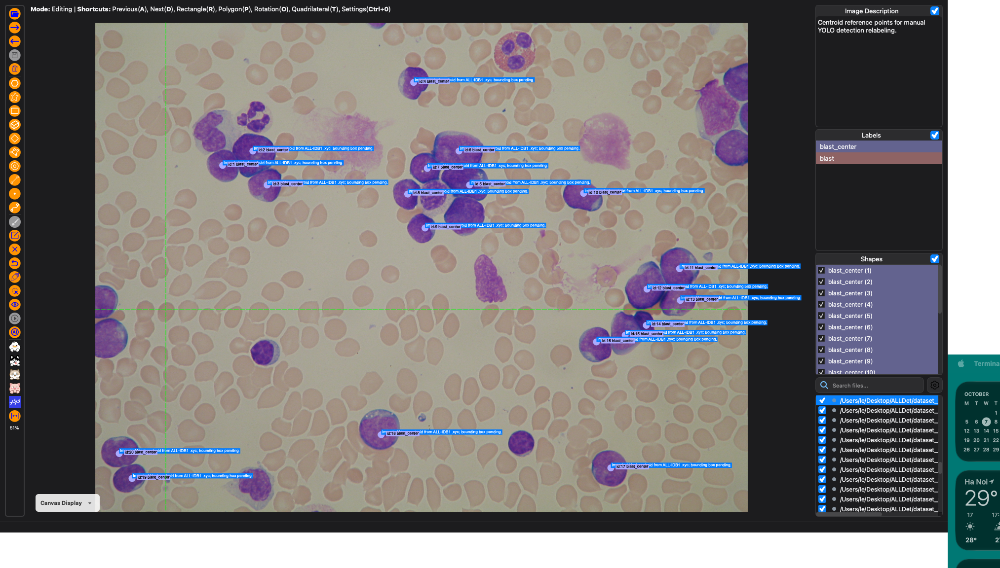
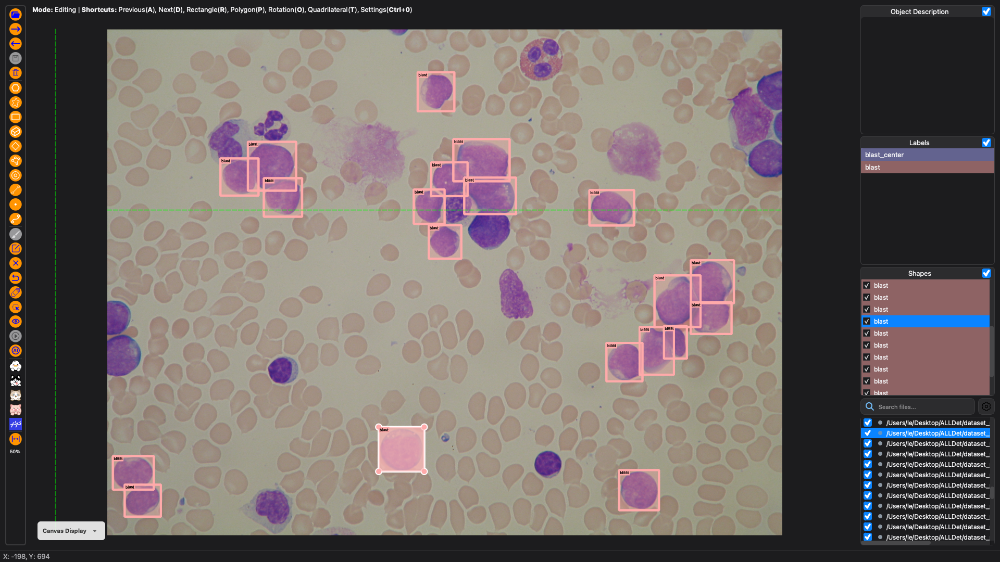

# Dataset Processing Log

*Review and Manual Reannotation of ALL-IDB1 for YOLO Object Detection*

**Entry:** 2  
**Date:** 7 October 2026

This entry reports the completed review and manual reannotation of ALL-IDB1. All **107 unique images** were processed, and **100% of the original blast-center annotations** were converted into bounding-box annotations.

## Rationale

The original ALL-IDB1 annotations identify blast-cell centers but do not describe cell extent. Bounding boxes were therefore required to support the planned YOLO object-detection experiments. Dataset review was also necessary to identify duplicate images and ensure consistent annotation across the working dataset.

## Processing Procedure

### 1. Review the Source Dataset

The original dataset contained 108 JPEG images and 108 corresponding `.xyc` annotation files. The review covered image readability, image–annotation correspondence, centroid coordinates, duplicate images, and visible image-quality concerns.

Differences in image dimensions, low-contrast samples, and arrows embedded in some source images were noted during inspection. Source images were retained without pixel modification.

### 2. Remove the Exact Duplicate

`Im108_0.jpg` was identified as an exact duplicate of `Im093_0.jpg` and excluded from the working copy. The original source dataset was preserved. The resulting working dataset contained **107 unique images: 49 positive images and 58 negative images**.

### 3. Prepare the Annotation Workspace

A separate workspace was prepared for X-AnyLabeling. The original `.xyc` coordinates were imported as point annotations labeled `blast_center`, providing 510 blast-center references across the working dataset. An image-level JSON annotation file was prepared for each of the 107 images.

### 4. Convert Center References into Bounding Boxes

Each positive image was opened in X-AnyLabeling. The imported center points were used to locate the corresponding blast cells, and rectangular bounding boxes labeled `blast` were drawn manually around their visible extent.

For adjacent or overlapping cells, individual cell boundaries were inspected to determine the box placement. The center annotations served as localization references, and box dimensions were determined from the visible cell boundaries.

### 5. Process All Images and Retain Negative Samples

The annotation workflow covered all 107 images. All blast-center references in the positive images were converted into rectangular annotations. The 58 negative images were retained without blast bounding boxes, preserving their role as negative samples for detection experiments.

### 6. Review and Save the Completed Annotations

The completed annotations were reviewed for conversion coverage, cell correspondence, and consistent use of the `blast` label. The results were saved in the native JSON annotation files. Processing was completed across the entire working dataset, with no original blast-center annotations left awaiting conversion.

## Results

### Completed Dataset

All **107 images** in the working dataset have completed the processing workflow. **100% of the original blast-center annotations** have been converted into bounding-box annotations, providing the cell-level spatial information required for the planned detection experiments.

**Table 1. Completed dataset-processing results**

| Item | Final result |
| --- | --- |
| Images in the original dataset | 108 |
| Exact duplicate excluded from the working copy | 1 |
| Unique images processed | **107 / 107 (100%)** |
| Positive images processed | 49 |
| Negative images retained | 58 |
| Original blast-center references | 510 |
| Center-to-bounding-box conversion coverage | **100%** |
| Target annotation | Rectangle labeled `blast` |
| Saved annotation format | Native JSON |
| Dataset review and manual reannotation status | **Completed** |

### Example 1 — Original Center References

*Figure 1. A representative blood-smear image in X-AnyLabeling before manual reannotation. The `blast_center` points locate target cells but do not specify bounding-box width or height.*

### Example 2 — Completed Bounding-Box Annotation

*Figure 2. The same blood-smear image after manual reannotation. Rectangles labeled `blast` describe the visible extent of the target cells, including cells situated close to one another. Together, Figures 1 and 2 illustrate the conversion from center references to bounding-box annotations.*
